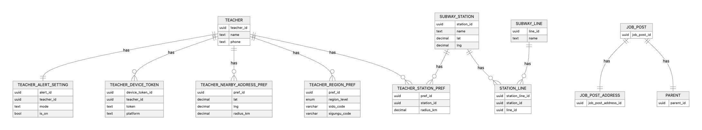

# 선생님 공고 추천
## 요구사항 정리
1. 공고 추천 서비스는 선생님과 부모님을 연결한다.
2. 부모님은 "특정 지역"(위치 기반)에 선생님 모집 공고를 등록할 수 있다.
3. 선생님은 "주소", "선호 지역", "지하철역" 중 1개의 조건으로 공고에 대한 알림(추천)을 받을 수 있다. 알림(추천)을 받을 수 있는 조건은 아래와 같다.
    1. "특정 지역"으로부터 5km 이내 "주소"를 설정한 선생님
    2. "특정 지역"이 포함된 "선호 지역"을 설정한 선생님
    3. "특정 지역"으로부터 1km 이내의 "지하철역"을 설정한 선생님
4. "주소", "선호 지역", "지하철역"은 선생님별로 n개 설정이 가능하다.

## 필수 API 요구사항

**Request**: 공고 주소 정보
  - 위도
  - 경도
  - 주소
  - 우편번호

**Response**: 공고 주소 기반 추천 선생님 정보
- 선생님 이름
- 선생님 전화번호

## ERD
### 요약
teacher
- 선생님 기본 정보

teacher_nearby_address_pref
- 선생님별 좌표 + 반경(기본 5km)

teacher_region_pref
- 행정구역 코드 매칭(시/도, 시군구)

subway_station
- 지하철역

subway_line
- 노선

station_line
- 지하철역 + 노선 매핑(n:m)

teacher_station_pref
- 지하철역 매칭

### 개념 모델링


### 물리 모델링(PostgreSQL 기준)


```text
Table teacher {
  id uuid [pk]
  name varchar(20) [not null]
  phone varchar(11) [not null]
  is_active bool [not null, default: true]
  created_at timestamp [default: `now()`]
  updated_at timestamp
}

Table parent {
  id uuid [pk]
}

Table job_post_address {
  id uuid [pk]
  addr_detail text [not null]
  sigungu text [not null]
  sido text [not null]
  zipcode text [not null]
}

Table job_post {
  id uuid [pk]
  parent_id uuid [ref: > parent.id, not null]
  job_post_address_id uuid [ref: > job_post_address.id, not null]
  detail text
}

Table teacher_nearby_address_pref {
  id uuid [pk]
  teacher_id uuid [ref: > teacher.id, not null]
  lat numeric(9, 6) [not null]
  lng numeric(9, 6) [not null]
  radius_km numeric(5,2) [not null, default: 5.00]
  created_at timestamp [default: `now()`]
  
  // check(radius_km > 0)

  Indexes {
    teacher_id
    (lat, lng)
  }
}

Table teacher_region_pref {
  id uuid [pk]
  teacher_id uuid [ref: > teacher.id, not null]
  region_level text // enum 'SIDO', 'SIGUNGU'
  sido_code varchar(20) // 있다고 가정
  sigungu_code varchar(20) // 있다고 가정
  created_at timestamp [default: `now()`]

  indexes {
    (teacher_id, region_level)
    teacher_id
    (region_level, sido_code)
    (region_level, sigungu_code)
  }
}

Table subway_station {
  id uuid [pk]
  name text [not null]
  lat numeric(9,6) [not null]
  lng numeric(9,6) [not null]
  created_at timestamp [default: `now()`]

  Indexes {
    (lat, lng)
  }
}

Table subway_line {
  id uuid [pk]
  name text [not null, unique]
  created_at timestamp [default: `now()`]
  updated_at timestamp
}

Table station_line {
  id uuid [pk]
  subway_station_id uuid [ref: > subway_station.id, not null]
  subway_line_id uuid [ref: > subway_line.id, not null]
  created_at timestamp [default: `now()`]

  Indexes {
    (subway_station_id, subway_line_id) [unique] // 유니크 기반 인덱스
  }
}

Table teacher_station_pref {
  id uuid [pk]
  teacher_id uuid [ref: > teacher.id, not null]
  subway_station_id uuid [ref: > subway_station.id, not null]
  radius_km numeric(5,2) [not null, default: 1.00]
  created_at timestamp [default: `now()`]

  Indexes {
    (teacher_id, subway_station_id) [unique] // 유니크 기반 인덱스
    teacher_id
    subway_station_id
  }

  // check(radius_km > 0)
}
```
## SQL(PostgresSQL 16 기준)
```sql
CREATE EXTENSION IF NOT EXISTS pg_uuidv7;

CREATE TABLE teacher (
  id          UUID PRIMARY KEY DEFAULT uuid_generate_v7(),
  name        VARCHAR(20) NOT NULL,
  phone       VARCHAR(11) NOT NULL,
  is_active   BOOLEAN NOT NULL DEFAULT TRUE,
  created_at  TIMESTAMP NOT NULL DEFAULT NOW(),
  updated_at  TIMESTAMP
);

CREATE TABLE parent (
  id UUID PRIMARY KEY DEFAULT uuid_generate_v7()
);

CREATE TABLE job_post_address (
  id           UUID PRIMARY KEY DEFAULT uuid_generate_v7(),
  addr_detail  TEXT NOT NULL,
  sigungu      TEXT NOT NULL,
  sido         TEXT NOT NULL,
  zipcode      TEXT NOT NULL
);

CREATE TABLE job_post (
  id                   UUID PRIMARY KEY DEFAULT uuid_generate_v7(),
  parent_id            UUID NOT NULL REFERENCES parent(id),
  job_post_address_id  UUID NOT NULL REFERENCES job_post_address(id),
  detail               TEXT
);

CREATE TABLE teacher_nearby_address_pref (
  id          UUID PRIMARY KEY DEFAULT uuid_generate_v7(),
  teacher_id  UUID NOT NULL REFERENCES teacher(id) ON DELETE CASCADE,
  lat         NUMERIC(9,6) NOT NULL,
  lng         NUMERIC(9,6) NOT NULL,
  radius_km   NUMERIC(5,2) NOT NULL DEFAULT 5.00 CHECK (radius_km > 0),
  created_at  TIMESTAMP NOT NULL DEFAULT NOW()
);

CREATE INDEX idx_tnap_teacher_id ON teacher_nearby_address_pref(teacher_id);
CREATE INDEX idx_tnap_lat_lng ON teacher_nearby_address_pref(lat, lng);

CREATE TABLE teacher_region_pref (
  id            UUID PRIMARY KEY DEFAULT uuid_generate_v7(),
  teacher_id    UUID NOT NULL REFERENCES teacher(id) ON DELETE CASCADE,
  region_level  TEXT CHECK (region_level IN ('SIDO','SIGUNGU')),
  sido_code     VARCHAR(20),
  sigungu_code  VARCHAR(20),
  created_at    TIMESTAMP NOT NULL DEFAULT NOW()
);

CREATE INDEX idx_trp_teacher_region_level on teacher_region_pref(teacher_id, region_level);
CREATE INDEX idx_trp_teacher_id ON teacher_region_pref(teacher_id);
CREATE INDEX idx_trp_level_sido_code ON teacher_region_pref(region_level, sido_code);
CREATE INDEX idx_trp_level_sigungu_code ON teacher_region_pref(region_level, sigungu_code);

CREATE TABLE subway_station (
  id          UUID PRIMARY KEY DEFAULT uuid_generate_v7(),
  name        TEXT NOT NULL,
  lat         NUMERIC(9,6) NOT NULL,
  lng         NUMERIC(9,6) NOT NULL,
  created_at  TIMESTAMP NOT NULL DEFAULT NOW()
);

CREATE INDEX idx_subway_station_lat_lng ON subway_station(lat, lng);

CREATE TABLE subway_line (
  id          UUID PRIMARY KEY DEFAULT uuid_generate_v7(),
  name        TEXT NOT NULL UNIQUE,
  created_at  TIMESTAMP NOT NULL DEFAULT NOW(),
  updated_at  TIMESTAMP
);

CREATE TABLE station_line (
  id                 UUID PRIMARY KEY DEFAULT uuid_generate_v7(),
  subway_station_id  UUID NOT NULL REFERENCES subway_station(id) ON DELETE CASCADE,
  subway_line_id     UUID NOT NULL REFERENCES subway_line(id) ON DELETE CASCADE,
  created_at         TIMESTAMP NOT NULL DEFAULT NOW(),
  CONSTRAINT uq_station_line_subway_station_subway_line UNIQUE (subway_station_id, subway_line_id)
);

CREATE TABLE teacher_station_pref (
  id                 UUID PRIMARY KEY DEFAULT uuid_generate_v7(),
  teacher_id         UUID NOT NULL REFERENCES teacher(id) ON DELETE CASCADE,
  subway_station_id  UUID NOT NULL REFERENCES subway_station(id) ON DELETE CASCADE,
  radius_km          NUMERIC(5,2) NOT NULL DEFAULT 1.00 CHECK (radius_km > 0),
  created_at         TIMESTAMP NOT NULL DEFAULT NOW(),
  CONSTRAINT uq_tsp_teacher_subway_station UNIQUE (teacher_id, subway_station_id)
);

CREATE INDEX idx_tsp_teacher_id ON teacher_station_pref(teacher_id);
CREATE INDEX idx_tsp_subway_station_id ON teacher_station_pref(subway_station_id);
```